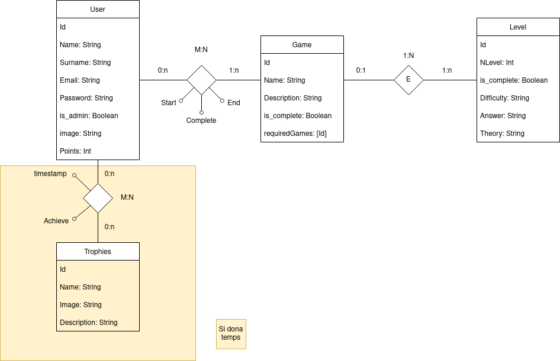
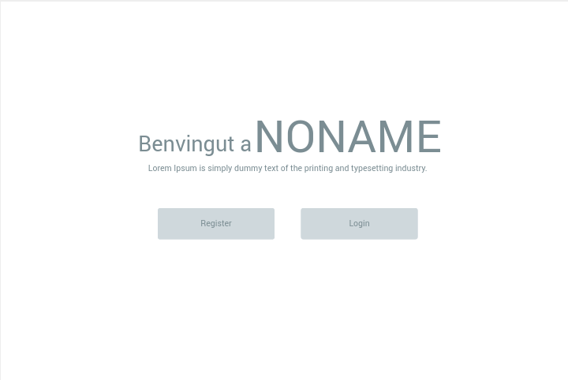
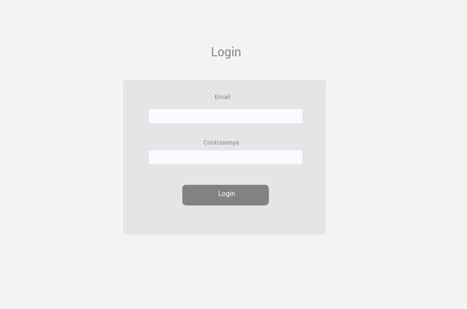
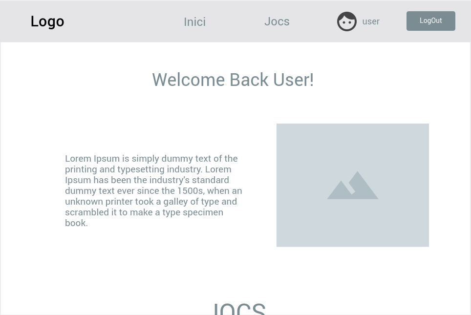
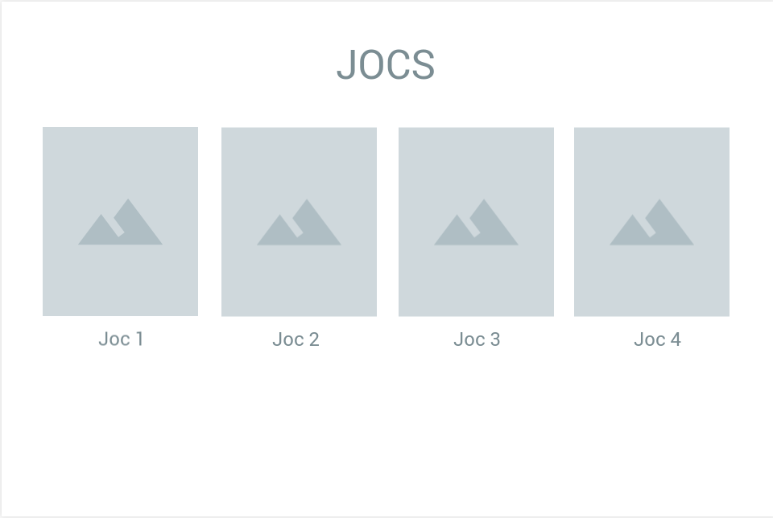
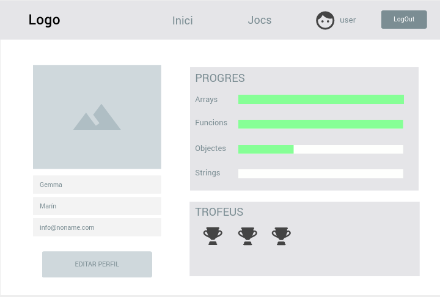
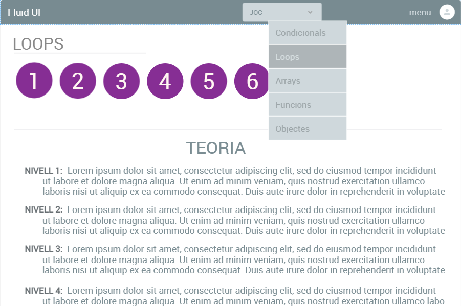
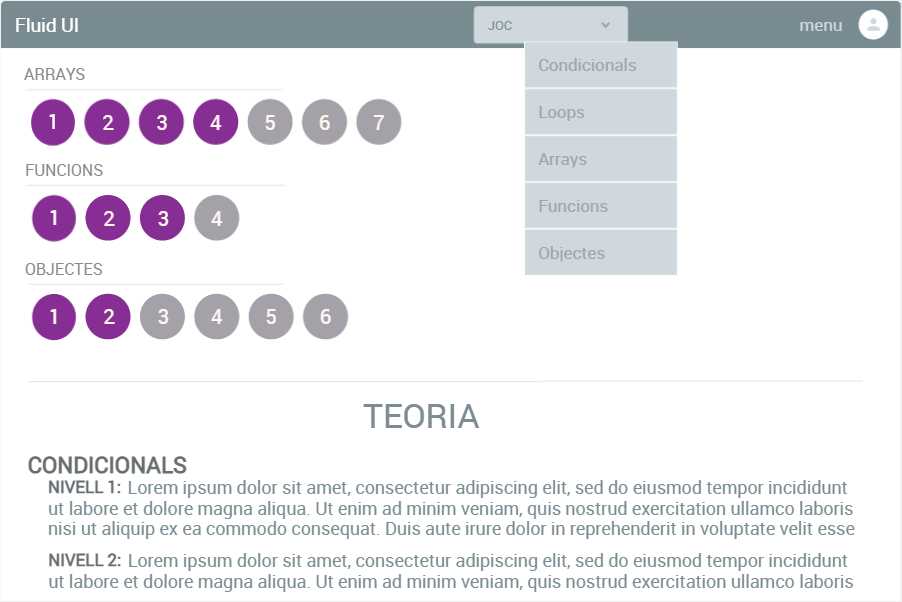
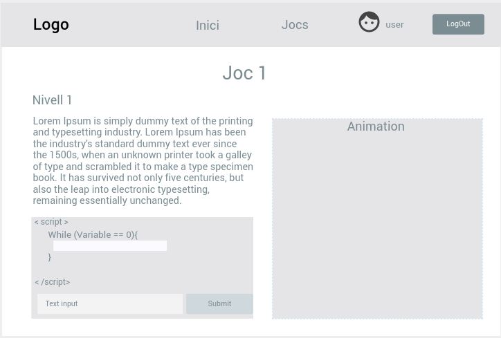

# NoName

## Inicializar proyecto
Utiliza Docker para cargar todo el proyecto empezar a funcionar

Ejecutar: docker-compose up -d  
Attach shell de node i fer npm run dev  
Afegir dades per iniciar:  http://localhost:3000/addAll
Afegir dades manualment: http://localhost:3000/adminInfo

Web: http://localhost:3000/  
MongoAdmin: http://localhost:4000/  

## Diagrames
- Casos d'Us:  

- BBDD:

## Mock-ups
- Pre Home:  

- Register:

- Login:

- Home:

- Profile:

- Game:

- Games:

- Play:

